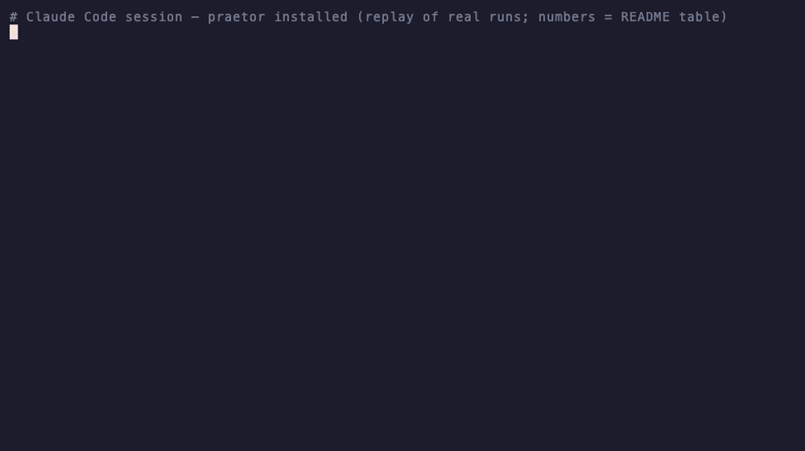
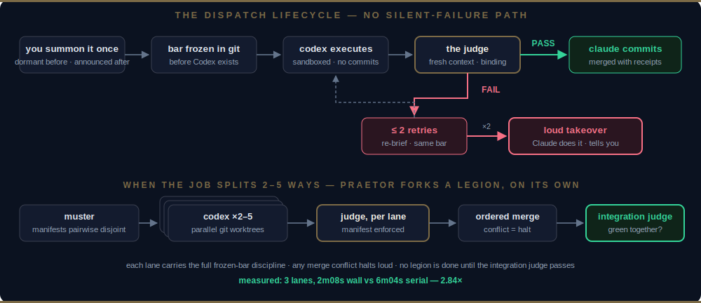

<p align="center"></p>

# praetor

**Claude plans. Codex executes. A judge you can't sweet-talk decides what merges.**

*The Roman praetor held both imperium — the power to command the legions — and the judgment seat. So does this plugin: command the legion, judge the work.*

A Claude Code plugin that lets Claude hand grunt work to the [Codex CLI](https://github.com/openai/codex) — **summon it once, then it triages on its own, announcing before each move** — with acceptance criteria frozen in git before Codex starts, and an independent fresh-context judge whose FAIL cannot be overridden.

**Why a judge?** In our live testing, roughly **1 in 3 unattended executor runs failed independent review** — every one of them work you'd otherwise have merged.

[](LICENSE) [](https://claude.com/claude-code) [](https://github.com/luoxianzi/praetor/actions/workflows/validate.yml) [](README.zh-CN.md)

[Tutorial](docs/TUTORIAL.md) · [Install](#install) · [Quick start](#quick-start) · [What's inside](#whats-inside) · [Measured, not promised](#measured-not-promised) · [How praetor differs](#how-praetor-differs) · [FAQ](#faq)

---



*Replay of real runs — every number and verdict above comes from the benchmark table below, including the timeout kill. Reproduce it: `vhs docs/assets/demo.tape`.*

## Why

**One commander, many soldiers.** Fable 5 is the strongest brain you can rent; GPT-5.5 is a tireless, efficient soldier. praetor wires them into an army: Claude holds the map and makes every judgment call — what to build, what to accept — while Codex grinds through the execution. When a big problem splits, Legion Mode puts **several soldiers on it at once, each owning one piece** (2.84× measured). Big problems stop being *long* problems.

- **Your Claude tokens buy judgment, not grunt work.** Bulk edits, mechanical test-writing, wide read-and-report analysis — these burn context and quota that Claude should spend on design and review. Codex runs them in its own process, on its own quota — **your Fable 5 budget lasts dramatically longer, and its context stays clean for the hard thinking.**
- **Delegation without verification is just hope.** That 1-in-3 failure rate above is exactly the work you'd otherwise have merged — so nothing merges here without a verdict.
- **Dormant until you call it; autonomous once you do.** In a conversation where you never summon it, praetor does nothing — Claude Code works exactly as before. Say the word once ("use codex") and it holds command for the conversation: triaging, splitting legions, announcing each dispatch in one line. "Don't send this" pins a task; "stop delegating" ends its term; a `STOP` file halts everything.

## Install

```
/plugin marketplace add luoxianzi/praetor
/plugin install praetor@praetor
```

That's it. **Zero configuration.** Idle footprint: **~313 always-on tokens** — that is the entire cost until the moment you dispatch. If `codex login` works on your machine, dispatch works. No config file, no wizard, no API keys handed to us — the plugin only shells out to your own authenticated Codex CLI.

Requirements: [Claude Code](https://claude.com/claude-code) + [Codex CLI](https://github.com/openai/codex) (`npm i -g @openai/codex`, then `codex login`). Windows: works under Git Bash or WSL (which Claude Code itself uses).

New here? The **[10-minute tutorial](docs/TUTORIAL.md)** walks a real dispatch end to end — the frozen bar, the verdict, and one real failure.

Updating later: `claude plugin update praetor@praetor` — installed plugins stay on their installed version until you update (by design), so grab fixes explicitly.

## Quick start

Open Claude Code in any git repo and appoint the praetor — once per conversation, in plain words:

```
"use codex for the grunt work"  ·  "交给codex"  ·  /praetor:delegate <task>
```

From that word on, it holds command for the conversation. Real grunt work — a 16-file rename, mechanical test-writing, a wide read-and-report — gets triaged by praetor itself and announced in one line before it moves:

> *Dispatching to Codex: migrate date formatting across src/ — bar frozen in git, ~4 min. Say the word to stop.*

Codex grinds in a sandbox, on its own quota. A fresh-context judge re-runs the frozen checks and inspects the diff. On PASS, Claude commits and hands you the receipts; on FAIL, ≤2 retries, then Claude does the work itself and says so. If the job splits into independent pieces, praetor spots it and runs a parallel legion — no extra asking. **One summon is the only special thing you ever do.** And in conversations where you never summon it? praetor stays completely dormant.

What happens next:

<p align="center"></p>

*Every state, with the real artifacts (frozen bar, verdict, one real failure): the [tutorial](docs/TUTORIAL.md).*

**Three iron laws — no exceptions:**

1. **No dispatch without a frozen bar in git.**
2. **No acceptance without the judge.** A FAIL cannot be overridden — not by Claude, not by a persuasive diff.
3. **Max 2 retries, then loud takeover.** Every failure path ends with Claude doing the work and telling you delegation failed.

Silent failure is treated as the #1 killer of tools like this. It has no path here.

## What's inside

**The lifecycle**
- **dispatching-to-codex** — the full loop: auto-triage → frozen bar → sandboxed exec → binding judge → commit or loud takeover
- **dispatching-legion** — 2–5 parallel workers in git worktrees, may-touch manifests, ordered merge, mandatory integration judge (**2.84× measured**)
- **writing-codex-briefs** — self-contained briefs + acceptance bars that actually protect you (red→green checks, exit codes, manifests)
- **codex-judge** — the fresh-context judge: never saw the plan, runs the real commands, cannot be overridden

**The guarantees**
- **Summoned imperium** — dormant until called in the conversation; once summoned, it triages and dispatches on its own, always announcing first; "don't send this" pins a task, "stop delegating" ends the term, `STOP` halts all
- **Frozen bar in git** — the definition of done is committed before Codex exists, and tamper-checked
- **Loud takeover** — there is no silent-failure path
- **Git-state boundary** — Codex edits files, never git; `.git` stays read-only by design
- **Zero config** — ~313 idle tokens; relay configs auto-respected; two env vars if you must

## Legion Mode — many workers, in parallel

The praetor commanded legions, plural. When a job splits into **2–5 genuinely independent, mechanical pieces**, praetor spots the split itself, announces the muster table (lanes, files, checks, the expected speedup), and runs each piece in its own git worktree with its own frozen bar and its own judge — then merges them in order behind a **mandatory integration judge** that catches "each piece passed alone, broke together." (Asking explicitly — *"dispatch these in parallel"* / *"派几路 codex 一起干"* — works too.)

Same laws, per lane. Zero new config: praetor sets the worker count from the task split (hard cap 5, more → waves), never a knob. Strictly disjoint file footprints or it refuses and serializes — *when in doubt, one at a time*. Best paired with [superpowers](https://github.com/obra/superpowers): its `writing-plans` cuts the work into independent lanes; praetor executes and judges them.

Real speedup exists only when the split is real. If it isn't, that's not a legion — it's one dispatch, and praetor says so.

Design rationale + live combat results (2.84× measured, and the trap the judge caught): **[docs/LEGION.md](docs/LEGION.md)**.

## Measured, not promised

Real numbers from repeated local runs are published here before anything else is claimed. Each row: one task class, wall-clock and token cost of *dispatch vs. Claude doing it directly*, and the judge's first-pass verdict rate:

| Task class | Claude solo | Dispatched | Verdict |
|---|---|---|---|
| Bulk mechanical edit — API rename across 16 files | ~1 min | ~4 min (2.6 min Codex + 1.4 min judge) | **Judge: PASS first try** (12-point review) — merged without reading the diff |
| Tiny task — one-line function | seconds | 1.7 min — and the 1st attempt died at the 4-min timeout | **Don't dispatch small tasks.** The skill says so before you waste the minutes |
| Unplanned bonus: transient stall | — | one 29-min zero-write hang → killed by the timeout law → retry succeeded in 2.6 min | **Loud takeover, never silent failure** — the law fired in real life |
| **Legion (v0.2): 3 parallel implementations** | ~6 min serial est. | **2 m 08 s wall — 2.84× speedup** | 3/3 judges PASS first try · zero-conflict merge · **integration judge PASS** |
| **Legion trap: brief lured the worker outside its manifest** | — | worker complied, tests green | **Judge FAILed the green-tests lane**, naming the exact file — [full combat report](docs/LEGION.md) |

First published runs — n=1 per arm, synthetic fixtures, one machine; medians replace these as repetitions accumulate. Full honesty: **2 of 4 dispatch attempts stalled** on our test machine and were killed by the hard timeout; both retries succeeded, and the judge passed delivered work on the first review. Wall-clock favors solo on small fixtures — dispatch pays in **quota shift and verified merges**, not raw speed.

Dispatch has real overhead (branch + freeze + judge). Small tasks are **faster without it** — the skill says so instead of dispatching anyway.

## How praetor differs

Other Claude↔Codex bridges exist and are good at what they do. What no other bridge combines: **a commander-grade brain freely commanding efficient soldiers — in parallel when the job splits — with every result independently verified, and your premium tokens spent only on judgment.** The factual breakdown:

| | Who decides to dispatch | What verifies the output | Config required |
|---|---|---|---|
| **praetor** | Summon once per conversation → auto-triage, announced before each move | Fresh-context judge; FAIL is binding | None (~313 tokens idle) |
| [codex-plugin-cc](https://github.com/openai/codex-plugin-cc) | You, via /codex commands | You read the result | Codex CLI auth |
| [skill-codex](https://github.com/skills-directory/skill-codex) | Claude, when the skill triggers | You read the result | Codex CLI + model prompts |
| [architect-loop](https://github.com/DanMcInerney/architect-loop) | Automatic within the loop | Gates + review inside the loop | Installer + orchestration setup |

## Relay / custom model users

Already pointing your Codex CLI at a relay or another model via `~/.codex/config.toml`? **It just works** — preflight detects a custom provider and respects your config instead of forcing flags. The judge protects quality regardless of the executor: a weaker model means more takeovers, never silently bad merges.

Officially recommended and tested path: **Codex `gpt-5.5` at `xhigh` effort.** Everything else: supported, not certified.

Escape hatches (that's all of them): `PRAETOR_MODEL` / `PRAETOR_EFFORT` env vars, and plain language — "don't send this to codex", "stop delegating for now". A `STOP` file in the repo root halts everything.

## FAQ

**What leaves my machine, and what do you see?** Nothing comes to us. The plugin shells out to your own authenticated Codex CLI — your keys, your relay, your quota.

**What happens when Codex fails?** ≤2 retries against the frozen criteria, then Claude loudly takes over and does the work itself. There is no silent-failure path.

**Can I (or Claude) override a FAIL?** No. That is the product. If you want an overridable judge, [docs/DESIGN.md](docs/DESIGN.md) explains why we won't build one.

**Will it dispatch without me asking?** Not until you've summoned it in that conversation — before that it is completely dormant, and Claude Code behaves as if praetor weren't installed. After one summon ("use codex" / "交给codex" / `/praetor:delegate`), yes: it triages and dispatches on its own judgment — including legion splits — **always announcing before it moves**. Brakes are standing: "don't send this" pins a task; "stop delegating for now" ends its term; a `STOP` file halts everything. What it will never do: dispatch silently, merge without the judge, or touch git state.

## What's deliberately NOT here

No config file. No model picker. No concurrency knobs. No background daemon. No dashboards. Retries are fixed at 2 — it's a tested law, not a preference. Every one of these was cut on purpose; see [docs/DESIGN.md](docs/DESIGN.md) before filing the issue. 🙂

## Acknowledgements

praetor's discipline patterns — iron laws with no-exceptions clauses, red-flag excuse tables, skills that trigger on "Use when…" — tip their helmet to [obra/superpowers](https://github.com/obra/superpowers). The craft was studied; no code or text was copied.

## License

MIT
